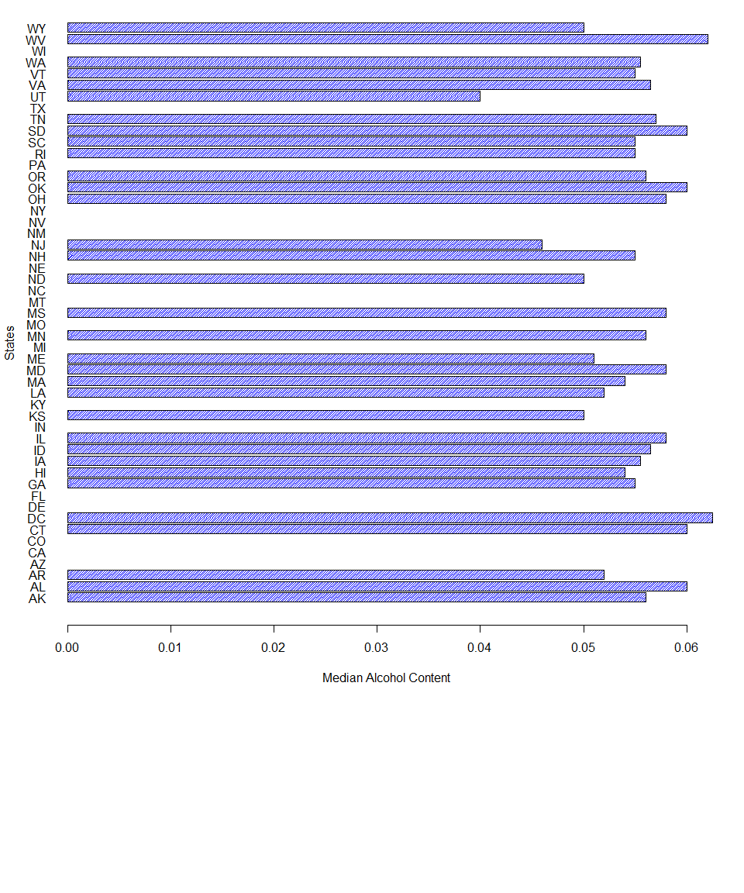
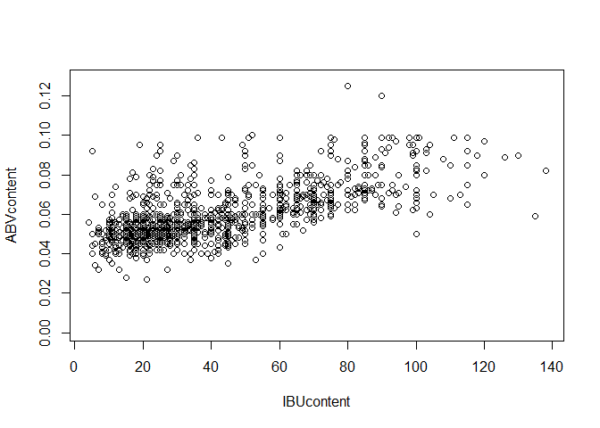

# Case Study 1
Nuoya & Meenu  
October 8, 2017  


```r
brewery <- read.csv("C:/Users/Dell Eater/Nuoya's/SMU Nuoya/MSDS6306/CaseStudy1/data/raw/Breweries.csv", sep = ',')

numberBrewery <- unique(brewery)
```

```r
beer <- read.csv("C:/Users/Dell Eater/Nuoya's/SMU Nuoya/MSDS6306/CaseStudy1/data/raw/Beers.csv", sep = ',')
colnames(beer) <- c('Name','Beer_ID','ABV','IBU','Brew_ID','Style','Ounces')
brewery$Brew_ID <- rownames(brewery)
mergebeer <- merge(beer,brewery,by = 'Brew_ID',all = FALSE)
mergebeer <- mergebeer[c(3,2,6,4,5,7,1,8,9,10)]
colnames(mergebeer)[2] <- 'Beer Name'
colnames(mergebeer)[8] <- 'Brewery Name'
first6 <- head(mergebeer,6)
last6 <- tail(mergebeer,6)
```


```r
numberNA <- colSums(is.na(mergebeer))
numberNA
```

```
##      Beer_ID    Beer Name        Style          ABV          IBU 
##            0            0            0           62         1005 
##       Ounces      Brew_ID Brewery Name         City        State 
##            0            0            0            0            0
```


```r
subsetbeer<- data.frame(mergebeer$State,
												mergebeer$ABV,
												mergebeer$IBU)

MedianABV <- tapply(subsetbeer$mergebeer.ABV,subsetbeer$mergebeer.State,median)
MedianIBU <- tapply(subsetbeer$mergebeer.IBU,subsetbeer$mergebeer.State,median)

MedianABV <-data.frame(MedianABV)
MedianIBU <-data.frame(MedianIBU)
finalmedian <- cbind(MedianABV,MedianIBU )

colnames(finalmedian) <- c('Median ABV','Median IBU')
finalmedian$states <- rownames(finalmedian)
finalmedian <- finalmedian[c(3,1,2)]
rownames(finalmedian) <- NULL
finalmedian
```

```
##    states Median ABV Median IBU
## 1      AK     0.0560         NA
## 2      AL     0.0600         NA
## 3      AR     0.0520         NA
## 4      AZ         NA         NA
## 5      CA         NA         NA
## 6      CO         NA         NA
## 7      CT     0.0600         NA
## 8      DC     0.0625         NA
## 9      DE         NA         NA
## 10     FL         NA         NA
## 11     GA     0.0550         NA
## 12     HI     0.0540         NA
## 13     IA     0.0555         NA
## 14     ID     0.0565         NA
## 15     IL     0.0580         NA
## 16     IN         NA         NA
## 17     KS     0.0500         NA
## 18     KY         NA         NA
## 19     LA     0.0520         NA
## 20     MA     0.0540         NA
## 21     MD     0.0580         NA
## 22     ME     0.0510         NA
## 23     MI         NA         NA
## 24     MN     0.0560         NA
## 25     MO         NA         NA
## 26     MS     0.0580       45.0
## 27     MT         NA         NA
## 28     NC         NA         NA
## 29     ND     0.0500       32.0
## 30     NE         NA         NA
## 31     NH     0.0550         NA
## 32     NJ     0.0460       34.5
## 33     NM         NA         NA
## 34     NV         NA         NA
## 35     NY         NA         NA
## 36     OH     0.0580         NA
## 37     OK     0.0600         NA
## 38     OR     0.0560         NA
## 39     PA         NA         NA
## 40     RI     0.0550         NA
## 41     SC     0.0550         NA
## 42     SD     0.0600         NA
## 43     TN     0.0570         NA
## 44     TX         NA         NA
## 45     UT     0.0400         NA
## 46     VA     0.0565         NA
## 47     VT     0.0550         NA
## 48     WA     0.0555         NA
## 49     WI         NA         NA
## 50     WV     0.0620       57.5
## 51     WY     0.0500         NA
```

```r
par(mar=c(18, 4.1, 4.1, 2.1), mgp=c(3, 1, 0), las=2) #http://rfunction.com/archives/1302

bp <- barplot(finalmedian$`Median ABV`,
      	ylab ='States',
        xlab  ='Median Alcohol Content',
				ylim = c(0,55),
				col = 'blue',
				horiz=T, 
				density = 50,
				las = 1)
```

<!-- -->


```r
maxcalculation <- data.frame(mergebeer$ABV,mergebeer$IBU)

colMax <- function(data) {sapply(data, max, na.rm = TRUE)}
colMax(maxcalculation)
```

```
## mergebeer.ABV mergebeer.IBU 
##         0.128       138.000
```

```r
maxabv <- mergebeer[which(mergebeer$ABV==0.128),]
maxabv <- maxabv[c(1,2,3,4,5,10)]
maxibu <- mergebeer[which(mergebeer$IBU==138),]
maxibu <- maxibu[c(1,2,3,4,5,10)]
maximum <- rbind(maxabv,maxibu)
maximum
```

```
##      Beer_ID                                            Beer Name
## 375     2565 Lee Hill Series Vol. 5 - Belgian Style Quadrupel Ale
## 1857     980                            Bitter Bitch Imperial IPA
##                               Style   ABV IBU State
## 375                Quadrupel (Quad) 0.128  NA    CO
## 1857 American Double / Imperial IPA 0.082 138    OR
```
question 6

```r
summaryABV <- summary(mergebeer$ABV)
summaryABV
```

```
##    Min. 1st Qu.  Median    Mean 3rd Qu.    Max.    NA's 
## 0.00100 0.05000 0.05600 0.05977 0.06700 0.12800      62
```


```r
IBUcontent <- mergebeer$IBU
ABVcontent <- mergebeer$ABV
linearABVIBU <- plot(ABVcontent~IBUcontent)
```

<!-- -->

