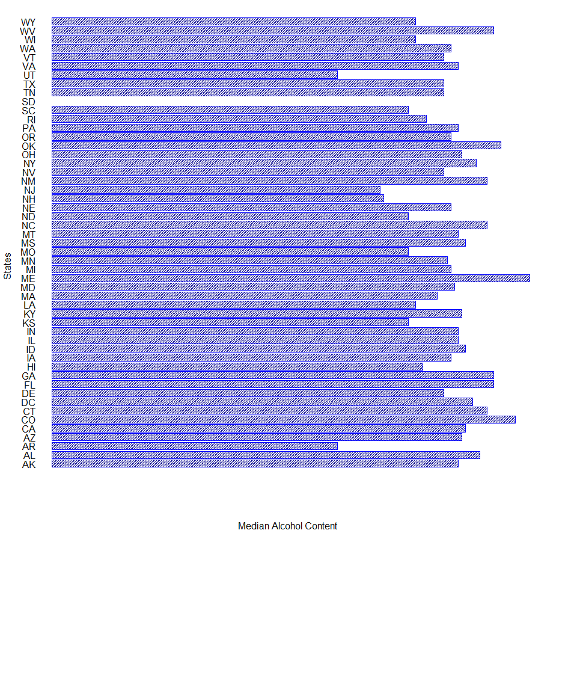
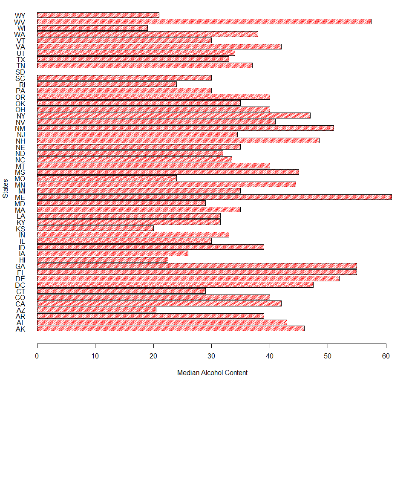
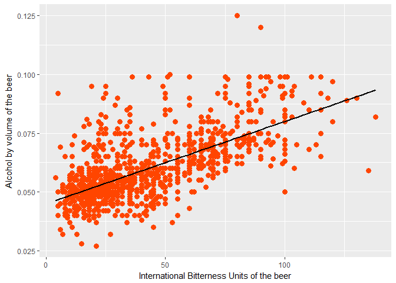

# Statewide Beer Availability Report
Nuoya & Meenu  
October 8, 2017  

### Introduction

This report summarizes the statistical analysis, analysis results and analysis plots associated with 2410 US craft beers and 588 US breweries inside United States of Ameirca. 

The purpose of this report is to illustrate data processing and modelling method used in this analysis as well as inferences and conclusions one can draw from it.

Project target is providing the analysis result to clients who want to invest in beer industy, with analysis results providing they will be able to have a general understanding of the local beer business trend of each state.

Project report including:

* Statistical analysis:

	+ comparing the median alcohol content and international bitterness unit for each state

	+ finding the maximum alcoholic beer and the most bitter beer

	+ making judgement of the relationship between ABV and IBU from data provided.

* Conclusion and references from the statistical analysis

### Analysis processes

1. Read 588 US breweries data sets into R and find out the number of breweries are present in each state.One can find the number of breweries of each state by checking eachstate output blow.

```r
#read the raw data of brewery#
brewery <- read.csv("C:/Users/Dell Eater/Nuoya's/SMU Nuoya/MSDS6306/CaseStudy1/data/raw/Breweries.csv", sep = ',')

#find out how many breweries are present in each state
eachstate <- table(factor(brewery$State))
eachstate <- data.frame(eachstate)
colnames(eachstate) <- c('States','Freq')
eachstate
```

```
##    States Freq
## 1      AK    7
## 2      AL    3
## 3      AR    2
## 4      AZ   11
## 5      CA   39
## 6      CO   47
## 7      CT    8
## 8      DC    1
## 9      DE    2
## 10     FL   15
## 11     GA    7
## 12     HI    4
## 13     IA    5
## 14     ID    5
## 15     IL   18
## 16     IN   22
## 17     KS    3
## 18     KY    4
## 19     LA    5
## 20     MA   23
## 21     MD    7
## 22     ME    9
## 23     MI   32
## 24     MN   12
## 25     MO    9
## 26     MS    2
## 27     MT    9
## 28     NC   19
## 29     ND    1
## 30     NE    5
## 31     NH    3
## 32     NJ    3
## 33     NM    4
## 34     NV    2
## 35     NY   16
## 36     OH   15
## 37     OK    6
## 38     OR   29
## 39     PA   25
## 40     RI    5
## 41     SC    4
## 42     SD    1
## 43     TN    3
## 44     TX   28
## 45     UT    4
## 46     VA   16
## 47     VT   10
## 48     WA   23
## 49     WI   20
## 50     WV    1
## 51     WY    4
```

2. Read 2410 US craft beers data set into R and merge with brewery data set by the Brewery ID. After merging, assign new column names to make the data set more understandable, remove missing values to make the best use of the existing data, show the first 6 beers and the last 6 beers. 

	+ The first 6 beers on the cleaned and merged data are: 
	
		Beer Name     | Style                              | State| Breweries
		--------------|------------------------------------|------|-----------------
		Get Together  | American IPA                       | MN   |NorthGate Brewing
		Maggie's Leap | Milk / Sweet Stout                 | MN   |NorthGate Brewing
		Wall's End    | English Brown Ale                  | MN   |NorthGate Brewing
		Pumpion       | Pumpkin Ale                        | MN   |NorthGate Brewing
		Stronghold    | American Porter                    | MN   |NorthGate Brewing
		Parapet ESB   | Extra Special / Strong Bitter (ESB)| MN   |NorthGate Brewing
		
	+ The last 6 beers on the cleaned and merged data are: 

		Beer Name                       | Style                 | State| Breweries
		--------------------------------|-----------------------|------|--------------------------
		Pyramid Hefeweizen (2011)       | Hefeweizen            | WA   |Pyramid Breweries
		Haywire Hefeweizen (2010)       | Hefeweizen            | WA   |Pyramid Breweries
		Rumspringa Golden Bock          | Maibock / Helles Bock | PA   |Lancaster Brewing Company
		Lancaster German Style Kölsch  | Kölsch               | PA   |Lancaster Brewing Company
		Common Sense Kentucky Common Ale| American Brown Ale    | NY   |Upstate Brewing Company
		Upstate I.P.W.                  | American IPA          | NY   |Upstate Brewing Company  
		

```r
#read the raw data of beer data set
beer <- read.csv("C:/Users/Dell Eater/Nuoya's/SMU Nuoya/MSDS6306/CaseStudy1/data/raw/Beers.csv", sep = ',')
colnames(beer) <- c('Name','Beer_ID','ABV','IBU','Brew_ID','Style','Ounces')

#merge them by brewery ID
brewery$Brew_ID <- rownames(brewery)
mergebeer <- merge(beer,brewery,by = 'Brew_ID',all = FALSE)
mergebeer <- mergebeer[c(3,2,6,4,5,7,1,8,9,10)]
colnames(mergebeer)[2] <- 'Beer Name'
colnames(mergebeer)[8] <- 'Brewery Name'

#cleaning the data, sort out first 6 and last 6
mergebeerclean <- na.omit(mergebeer)
#find the first 6 and last 6
first6 <- head(mergebeer,6)
first6
```

```
##   Beer_ID     Beer Name                               Style   ABV IBU
## 1    2692  Get Together                        American IPA 0.045  50
## 2    2691 Maggie's Leap                  Milk / Sweet Stout 0.049  26
## 3    2690    Wall's End                   English Brown Ale 0.048  19
## 4    2689       Pumpion                         Pumpkin Ale 0.060  38
## 5    2688    Stronghold                     American Porter 0.060  25
## 6    2687   Parapet ESB Extra Special / Strong Bitter (ESB) 0.056  47
##   Ounces Brew_ID       Brewery Name        City State
## 1     16       1 NorthGate Brewing  Minneapolis    MN
## 2     16       1 NorthGate Brewing  Minneapolis    MN
## 3     16       1 NorthGate Brewing  Minneapolis    MN
## 4     16       1 NorthGate Brewing  Minneapolis    MN
## 5     16       1 NorthGate Brewing  Minneapolis    MN
## 6     16       1 NorthGate Brewing  Minneapolis    MN
```

```r
last6 <- tail(mergebeer,6)
last6
```

```
##      Beer_ID                 Beer Name                   Style   ABV IBU
## 2405      98             Pilsner Ukiah         German Pilsener 0.055  NA
## 2406      52  Heinnieweisse Weissebier              Hefeweizen 0.049  NA
## 2407      51           Snapperhead IPA            American IPA 0.068  NA
## 2408      50         Moo Thunder Stout      Milk / Sweet Stout 0.049  NA
## 2409      49         Porkslap Pale Ale American Pale Ale (APA) 0.043  NA
## 2410      30 Urban Wilderness Pale Ale        English Pale Ale 0.049  NA
##      Ounces Brew_ID                  Brewery Name          City State
## 2405     12     556         Ukiah Brewing Company         Ukiah    CA
## 2406     12     557       Butternuts Beer and Ale Garrattsville    NY
## 2407     12     557       Butternuts Beer and Ale Garrattsville    NY
## 2408     12     557       Butternuts Beer and Ale Garrattsville    NY
## 2409     12     557       Butternuts Beer and Ale Garrattsville    NY
## 2410     12     558 Sleeping Lady Brewing Company     Anchorage    AK
```

2. Summarise the number of missing values of each column. 

Column Name | Total Number of NA         
------------|--------------------
Beer_ID     | 	0          
Beer Name 	| 	0               
Style	    	| 	0            
ABV         | 	62        
IBU         | 	1005 
Ounces      | 	0        
Brew_ID     | 	0   
Brewery Name| 	0   
City     		| 	0    
State     	| 	0    


```r
numberNA <- colSums(is.na(mergebeer))
numberNA <- data.frame(numberNA)
numberNA
```

```
##              numberNA
## Beer_ID             0
## Beer Name           0
## Style               0
## ABV                62
## IBU              1005
## Ounces              0
## Brew_ID             0
## Brewery Name        0
## City                0
## State               0
```
3. This analysis process is based on the cleaned and merged data set. The goal is to get the median alcohol content and international bitterness unit for each state and plot out the bar chart for comparison of medians of each state.Please find the bar plot outputs(You can also find the plots inside the report/plots folder.) as well as the table below for meidans of alcohol content and international bitterness unit. 


```r
#subset the data as state,ABV and IBU
subsetbeer<- data.frame(mergebeerclean$State,
												mergebeerclean$ABV,
												mergebeerclean$IBU)

#apply the function by using tapply to find the median.
MedianABV <- tapply(subsetbeer$mergebeerclean.ABV,subsetbeer$mergebeerclean.State,median)
MedianIBU <- tapply(subsetbeer$mergebeerclean.IBU,subsetbeer$mergebeerclean.State,median)

#combine the together
MedianABV <-data.frame(MedianABV)
MedianIBU <-data.frame(MedianIBU)
finalmedian <- cbind(MedianABV,MedianIBU)

#adjust the names and make a finalmedian dataframe
colnames(finalmedian) <- c('Median ABV','Median IBU')
finalmedian$states <- rownames(finalmedian)
finalmedian <- finalmedian[c(3,1,2)]
rownames(finalmedian) <- NULL
finalmedian
```

```
##    states Median ABV Median IBU
## 1      AK     0.0570       46.0
## 2      AL     0.0600       43.0
## 3      AR     0.0400       39.0
## 4      AZ     0.0575       20.5
## 5      CA     0.0580       42.0
## 6      CO     0.0650       40.0
## 7      CT     0.0610       29.0
## 8      DC     0.0590       47.5
## 9      DE     0.0550       52.0
## 10     FL     0.0620       55.0
## 11     GA     0.0620       55.0
## 12     HI     0.0520       22.5
## 13     IA     0.0560       26.0
## 14     ID     0.0580       39.0
## 15     IL     0.0570       30.0
## 16     IN     0.0570       33.0
## 17     KS     0.0500       20.0
## 18     KY     0.0575       31.5
## 19     LA     0.0510       31.5
## 20     MA     0.0540       35.0
## 21     MD     0.0565       29.0
## 22     ME     0.0670       61.0
## 23     MI     0.0560       35.0
## 24     MN     0.0555       44.5
## 25     MO     0.0500       24.0
## 26     MS     0.0580       45.0
## 27     MT     0.0570       40.0
## 28     NC     0.0610       33.5
## 29     ND     0.0500       32.0
## 30     NE     0.0560       35.0
## 31     NH     0.0465       48.5
## 32     NJ     0.0460       34.5
## 33     NM     0.0610       51.0
## 34     NV     0.0550       41.0
## 35     NY     0.0595       47.0
## 36     OH     0.0575       40.0
## 37     OK     0.0630       35.0
## 38     OR     0.0560       40.0
## 39     PA     0.0570       30.0
## 40     RI     0.0525       24.0
## 41     SC     0.0500       30.0
## 42     SD         NA         NA
## 43     TN     0.0550       37.0
## 44     TX     0.0550       33.0
## 45     UT     0.0400       34.0
## 46     VA     0.0570       42.0
## 47     VT     0.0550       30.0
## 48     WA     0.0560       38.0
## 49     WI     0.0510       19.0
## 50     WV     0.0620       57.5
## 51     WY     0.0510       21.0
```

```r
#draw the bar plot pf abv
par(mar=c(18, 4.1, 4.1, 4.1), mgp=c(3, 1, 0), las=2) #http://rfunction.com/archives/1302

bp <- barplot(finalmedian$`Median ABV`,
      	ylab ='States',
        xlab  ='Median Alcohol Content',
				ylim = c(0,55),
				col = 'blue',
				horiz=TRUE, 
				density = 50,
				las = 1)
```

<!-- -->

```r
#draw the bar plot pf IBU
par(mar=c(18, 4.1, 4.1, 2.1), mgp=c(3, 1, 0), las=2) #http://rfunction.com/archives/1302

bp <- barplot(finalmedian$`Median IBU`,
      	ylab ='States',
        xlab  ='Median Alcohol Content',
				ylim = c(0,55),
				col = 'red',
				horiz=T, 
				density = 50,
				las = 1)
```

<!-- -->

4. Find out the state that has the maximum alcoholic beer and the state that has the most bitter beer.

* The maximum alcoholic beer is London Balling.It is from KY with ABV value 0.125

Beer Name   		| Style              | State | ABV value
----------------|--------------------|-------|-----------
London Balling  | English Barleywine | KY    | 0.125
	
* The most bitter beer is Bitter Bitch Imperial IPA.It is from OR with IBU value 138.

Beer Name   						     | Style           				     | State | IBU value
-----------------------------|-----------------------------|-------|-----------
Bitter Bitch Imperial IPA    | American Double/Imperial IPA| OR    | 138
			

```r
maxcalculation <- data.frame(mergebeerclean$ABV,mergebeerclean$IBU)
#use a function to find them and also not including the na values
colMax <- function(data) {sapply(data, max, na.rm = TRUE)}
colMax(maxcalculation)
```

```
## mergebeerclean.ABV mergebeerclean.IBU 
##              0.125            138.000
```

```r
#find the value and combine them
maxabv <- mergebeerclean[which(mergebeerclean$ABV==0.125),]
maxabv <- maxabv[c(1,2,3,4,5,10)]
maxibu <- mergebeerclean[which(mergebeerclean$IBU==138),]
maxibu <- maxibu[c(1,2,3,4,5,10)]
maximum <- rbind(maxabv,maxibu)
maximum
```

```
##      Beer_ID                 Beer Name                          Style
## 8       2685            London Balling             English Barleywine
## 1857     980 Bitter Bitch Imperial IPA American Double / Imperial IPA
##        ABV IBU State
## 8    0.125  80    KY
## 1857 0.082 138    OR
```
5. The following is to provide a statistical summary of the ABV values

Min  | 1st Quantile(25%)| Median | Mean  | 3rd Quantile(75%) | Max    | 
-----|------------------|--------|-------|-------------------|--------|
0.027| 0.05000          | 0.057  |0.05991| 0.06800           | 0.12500|  

```r
summaryABV <- summary(mergebeerclean$ABV)
summaryABV
```

```
##    Min. 1st Qu.  Median    Mean 3rd Qu.    Max. 
## 0.02700 0.05000 0.05700 0.05991 0.06800 0.12500
```


```r
library(ggplot2)
cor(mergebeerclean$IBU, mergebeerclean$ABV)
```

```
## [1] 0.6706215
```

```r
ggplot(mergebeerclean, aes(x=IBU, y=ABV)) + 
  geom_point(color = "orange red", size = 3)+
  geom_smooth(method=lm, se = FALSE, color = "black") +
  labs(x="International Bitterness Units of the beer", y="Alcohol by volume of the beer")
```

<!-- -->

### Conclusion and Inferences

The purpose of this analysis is to provide the analysis result to who want to invest in beer industy, with analysis results providing you will be able to have a general understanding of the local beer business trend of each state.

* Conclusion and inferences: 

	* ABV and IBU findings:

	* Based on the barplots for ABV and IBU and the barplots are based on the cleaned and merged data.
	
		* West Virgina has both relatively high ABV and IBU. This applies to Michigan, Georgia and Florida.
	
	 	* While Wisconsin has a lower IBU, the ABV is relatively high. This also applies to Kansas, Arizona.
	 	
		* The maximum alcoholic beer is London Balling.It is from KY with ABV value 0.125
	
		* The most bitter beer is Bitter Bitch Imperial IPA.It is from OR with IBU value 138.
	
* Relationship between ABV and IBU: 

Based on the scatter plot, you can see that there is a positive realtionship between ABV and IBU which means when the IBU increases then ABV will increases too. Based on the data provided by the clients, beers with ABV less than 0.0075 and IBU less than 50 takes the majority of the points on the grah. The scatter plot also shows the extreme values which are the maximum alcoholic beer, London Balling with ABV value 0.125 and the most bitter beer,Bitter Bitch Imperial IPA with IBU value 128.
	
